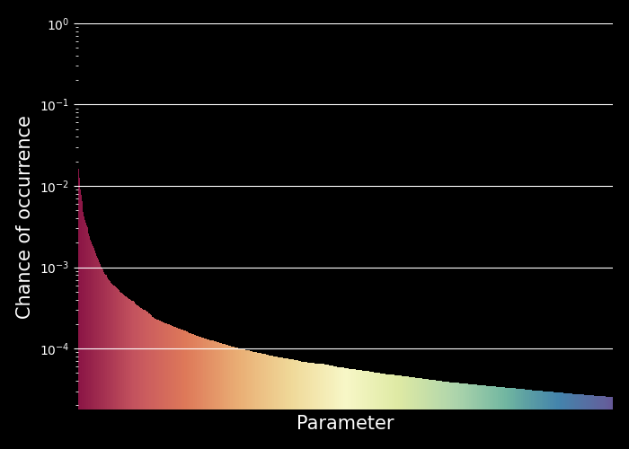

# Samlists

You'll never find what you're not looking for, so these wordlists are:

1. **Comprehensive**. These wordlists are constructed by analyzing terabytes of data from the biggest data sources around.

2. **Based on RECENT data**. Tech evolves fast, why shouldn't wordlists? The wordlists are based exclusively on data from up to a year ago, and will keep changing as tech changes.

3. **Created with SCIENCE**. By using some data science to remove outliers, generally crappy results and much else we remove much of the human element and biases to give you much more relevant and language-agnostic results. 

4. **Magical**. The construction of these wordlists is automagic, meaning in a year from now this github repo will still have up-to-date and high quality wordlists.

5. **Sorted**. By rows being sorted from most likely to occur to least likely, your chances of finding juicy stuff as fast as possible is much better, making the wordlists uniquely suitable when speed *AND* comprehensiveness are required.

6. **Explainable**. Many items in popular wordlists have no basis in real life except for what the author *thinks* will work. Every row in these wordlists is derived from real data.

As you can see, the top 3000 rows in the parameters wordlist map quite beautifully to their likelihood of being found in websites.

## Wordlists

Use the mixed case wordlist unless you are sure your target is case insensitive. Or don't. I'm a README, not a cop.   

| Wordlist name  | Size(s) |  Description            |
| ------------- | ------------- |------------- |
| sam-cc-parameters-(mixedcase&vert;lowercase)-all.txt  |  ~50,000 | HTTP parameter names. Use this to find hidden functionality! Basically what would go in `{here}` for the URL `http://example.com?{here}=value`.            |
| sam-gh-directories-(mixedcase&vert;lowercase)-top(size).txt  | 1,000 10,000 100,000| Directory names as found in all open-source GitHub repos. Useful for brute-forcing host directories.           |
| sam-gh-files-(mixedcase&vert;lowercase)-top(size).txt  | 1,000 10,000 100,000 1,000,000| File names as found in all open-source GitHub repos. Useful for brute-forcing files, especially blind.            |

## Methodology

The wordlists are created by trawling through huge [public datasets](#data-sources). The methods employed are a bit different based on the noisiness of the data source, but in general:

1. Deleting duplicate items from the same source (e.g. repo or domain) to allow the final frequency to represent their global frequency as opposed to letting small but repetitive sources dominate.
2. Pruning items that are too rare to be of general interest based on their rate of occurrence (generally at least 10-100 occurrences)
3. Using shannon entropy to remove random values, tokens and UUIDs.
4. Removing items that are broken due to incorrect encoding and/or decoding.

## Data sources

The data source is given in the name of the file, to make them easy to tell apart.

`cc` = [CommonCrawl](https://CommonCrawl.org)

`gh` = [GitHub BigQuery Public Dataset](https://cloud.google.com/bigquery/public-data)
